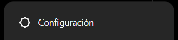
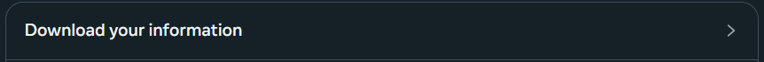
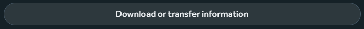
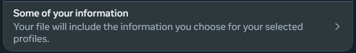
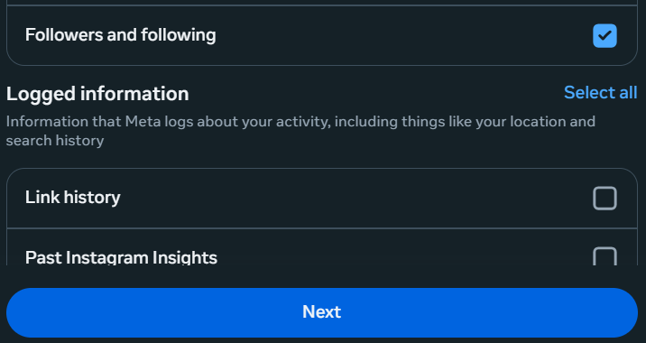
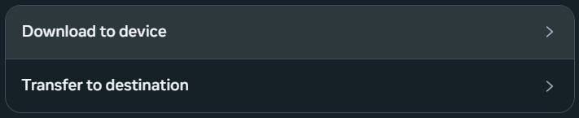
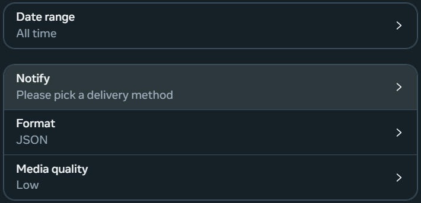

# INSTAGRAM FOLLOWERS & UNFOLLOWERS COUNT

## Instructions
Enter to your Instagram User Account Center:

Then download some of your information:

Select "Followers and following", click Next and "Download to device":

Fill your notify method and the rest of configurations just as below:

Click "Download" button and wait 15-20 minutes to file is ready. When zip file is ready save it and just drop it in the repository folder. Run all cells of \b{main.ipynb}. Then infomation about your connections will be ilustrated in the notebook outputs.

